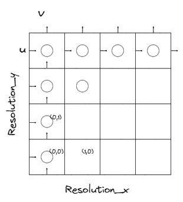

# Advection-Reflection Fluid

This article provides a step-by-step tutorial on how to build a simple plume in the advection-reflection scheme, using Taichi framework.

## Simple Advection-Projection

### Theory

#### Navier-Stokes Equation

#### Decomposition of the Equation

$$\begin{align*}
\frac{Dq}{Dt}  & = 0   & \quad \text{(advection)}\\
\frac{ \partial \mathbf{u} }{ \partial t } &  = \mathbf{f} & \quad \text{(body forces)}  \\
\frac{ \partial \mathbf{u} }{ \partial t } + \frac{1}{\rho}\nabla p &  = 0 \quad \text{s.t. } \nabla \cdot \mathbf{u} = 0 & \quad \text{(pressure/incompressibility)}
\end{align*}$$

##### Advection

To solve the advection equation
$$\frac{Dq}{Dt} = 0$$
it's impossible to use forward Euler because it's unconditionally unstable for this discretization of the spatial derivative: no matter how small we make $\Delta t$, it will always eventually blow up.

#### Semi-Lagrangian

This is a simple, physically-motivated approach. The idea is very simple:
The new value of $q$ at some point $\mathbf{x}$ in space is just what the old value of $q$ was for the particle that ends up at $\mathbf{x}$.

Imagine we have a hypothetical particle. At time $t$, it has an old value $q_{P}^{n}$ at point $\mathbf{x}_{P}$, and at time $t+\Delta t$, it has a new value $q^{n+1}_{G}$ at point $\mathbf{x}_{G}$. Then $q_{G}^{n+1} = q_{P}^{n}$.

If we have the current state, we could say that after $\Delta t$, the particle at $\mathbf{x}_{P}$ will arrive at point $\mathbf{x}_{G}$
$$
\mathbf{x}_{P} = \mathbf{x}_{G} - \Delta t \mathbf{u}_{G}
$$
then we could update the state and say that the particle at $\mathbf{x}_{G}$ at $t+\Delta t$ has value $q_{P}^{n}$. If the point $\mathbf{x}_{P}$ is not on the grid, we could interpolate it from $q^{n}$ at nearby grid points.

Putting all together, the simplest semi-Lagrangian formula is
$$
q_{g}^{n+1} = \textsf{intpolate}(q^{n}, \mathbf{x}_{G}-\Delta t\mathbf{u}_{G})
$$

##### Body Force

This step is fairly easy. Simply use forward Euler, we could finish this step.

##### Projection

The `project` routine will substract off the pressure gradient from the intermediate velocity field $\mathbf{u}$:
$$\mathbf{u}^{n+1} = \mathbf{u} - \Delta t \frac{1}{\rho}\nabla p$$
so that the result satisfies incompressibility inside the fluid
$$\nabla \cdot \mathbf{u}^{n+1} = 0$$
and satisfies the solid wall boundary conditions
$$\mathbf{u}^{n+1} \cdot \mathbf{n} = \mathbf{u}_{\text{solid}}\cdot \mathbf{n}$$

Using the central difference approximations the update rule is
$$\begin{aligned}
&u_{i+1 / 2, j}^{n+1}=u_{i+1 / 2, j}-\Delta t \frac{1}{\rho} \frac{p_{i+1, j}-p_{i, j}}{\Delta x} \\
&v_{i, j+1 / 2}^{n+1}=v_{i, j+1 / 2}-\Delta t \frac{1}{\rho} \frac{p_{i, j+1}-p_{i, j}}{\Delta x}
\end{aligned}$$
and in 3D
$$\begin{aligned}
&u_{i+1 / 2, j, k}^{n+1}=u_{i+1 / 2, j, k}-\Delta t \frac{1}{\rho} \frac{p_{i+1, j, k}-p_{i, j, k}}{\Delta x} \\
&v_{i, j+1 / 2, k}^{n+1}=v_{i, j+1 / 2, k}-\Delta t \frac{1}{\rho} \frac{p_{i, j+1, k}-p_{i, j, k}}{\Delta x} \\
&w_{i, j, k+1 / 2}^{n+1}=w_{i, j, k+1 / 2}-\Delta t \frac{1}{\rho} \frac{p_{i, j, k+1}-p_{i, j, k}}{\Delta x}
\end{aligned}$$

However the pressure we use in the `project` routine must make $\mathbf{u}^{n+1}$ divergence-free and satisfies the boundary conditions. We will see later this turns out to be a liner system on $p$ with constraints.

Now we can formulate the `project` step. Plug $\mathbf{u}^{n+1} = \mathbf{u} - \Delta t \frac{1}{\rho}\nabla p$ into $\nabla \cdot\mathbf{u}^{n+1} = 0$, we have
$$\nabla \cdot\left( \mathbf{u} - \Delta t \frac{1}{\rho} \nabla p \right) = 0
\iff \frac{\Delta t}{\rho} \nabla^{2} p = \nabla \cdot \mathbf{u}$$
which is a Poisson equation. We need to solve it with boundary conditions on $p$.

The Laplacian operator on cell $(i,j)$ is 
$$
\color{red}{-} \color{black}\frac{4 p_{i, j}-p_{i+1, j}-p_{i, j+1}-p_{i-1, j}-p_{i, j-1}}{\Delta x^2}
$$

##### Boundary Conditions

**The Boundary Conditions for Velocity**

- Inviscid
For solid walls or any other solid material, the fluid should not be flowing into the solid or out of it, thus the normal component of velocity has to be zero:
$$\mathbf{u} \cdot \mathbf{n} = 0$$
Or if the solid is moving, we need the normal component of the fluid velocity to match the normal component of the solid’s velocity:
$$\mathbf{u} \cdot \mathbf{n} = \mathbf{u}_{\text{solid}} \cdot \mathbf{n}$$
In both equations, $\mathbf{n}$ is the normal to the solid boundary.

- Viscous
The simplest case is the "no slip" boundary condition, which states
$$\mathbf{u} = 0$$
or if the solid is moving
$$\mathbf{u} = \mathbf{u}_{\text{solid}}$$

**The Boundary Conditions for Pressure:**

- Free surface:
Since we assume that the pressure is simply zero outside the fluid, we replace the $p_{i,j,k}$'s that lie in air cells with zero.

- Solid walls:
The condition on pressure on solid walls comes from the condition on velocity. Supposing grid cell $(i,j)$ was fluid and grid cell $(i+1,j)$ was solid, we would update $u_{i+1/2,j}$ with
$$
u_{i+1 / 2, j}^{n+1}=u_{i+1 / 2, j}-\Delta t \frac{1}{\rho} \frac{p_{i+1, j}-p_{i, j}}{\Delta x}
$$
rearrange it and replace $u_{i+1 / 2, j}^{n+1}$ with $u_{\text{solid}}$, we have boundary condition on $p$:
$$
p_{i+1, j}=p_{i, j}+\frac{\rho \Delta x}{\Delta t}\left(u_{i+1 / 2, j}-u_{\text {solid }}\right)
$$

#### Free Surfaces

This is where we stop modeling the fluid. For example, if we simulate water splashing around, then the water surfaces that are not in contact with a solid wall are free surfaces.

Since air is 700 times lighter than water, we could safely ignores its effect and set the pressure outside the fluid to be $0$.

And we don't impose any condition on the velocity.

### Implementation

A basic fluid algorithm is as following:
>
> - Start with an initial divergence-free velocity filed $\mathbf{u}^{(0)}$
> - For time step $n=0,1,2$
>   - Determine a good time step $\Delta t$ to go from time $t_{n}$ to time $t_{n+1}$
>   - Set $\mathbf{u}^{A} = \textsf{advect}(\mathbf{u}^{n}, \Delta t, \mathbf{u}^{n})$
>   - Add $\mathbf{u}^{B} = \mathbf{u}^{A} + \Delta t \mathbf{f}$
>   - Set $\mathbf{u}^{n+1} = \textsf{project}(\Delta t, \mathbf{u}^{B})$

#### Initialization

We are going to fully leverage the grid below:


It has $4\times 4$ quads, $5 \times 5$ vertices, $4 \times 5$ horizontal edges and $5 \times 4$ vertical edges.

#### Data Structure


Let `Res_x` and `Res_y` be the number of squares in a row and number squares in a column.  Then quantity $q$ has dimension `(res_x, res_y)` while velocity field $u$ has dimension `(res_x+1, res_y)` and velocity field $v$ has dimension `(res_x, res_y+1)`.

```python
q = ti.field(float, shape=(res_x,res_y))
u = ti.Vector.field(float, shape=(res_x+1,res_y))
v = ti.Vector.field(float, shape=(res_x,res_y+1))
```

#### Advection

##### Semi-Lagrangian

##### MacCormack

#### Body Force

##### Buoyancy

##### Wind

#### Projection

##### Velocity border condition

##### Pressure border condition

##### Solve Poisson Equation

## Advection-Reflection

## Resources

- [Fluid Simulation SIGGRAPH 2007 Course Notes](https://www.cs.ubc.ca/~rbridson/fluidsimulation/fluids_notes.pdf)
- [An Advection-Reflection Solver for Detail-Preserving Fluid Simulation](https://jzehnder.me/publications/advectionReflection/)
- [A Second-Order Advection-Reflection Solver](https://www.cse.iitd.ac.in/~narain/ar2/)
