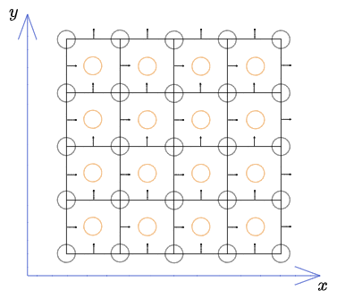
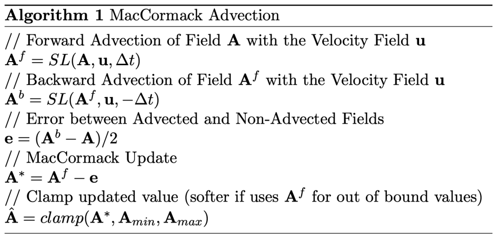

# Physically based Fluid Simulation

This is a course project of 252-0546-00L Physically-Based Simulation in Computer Graphics HS2022 at ETH Zurich. We wish to provide an easy-to-understand pipeline for fluid simulation incorporating different basic algorithms. We assume that you have some basic theoretical understanding about fluid simulation

## Usage

### Requirements

- Python 3.10.4
- Taichi 1.2.2
- click

### Installation

``` bash
pip install taichi==1.2.2
pip install click
```

### Run

``` bash
# show instructions
python plume_sim.py --help

# example usage
## default arguments with solid boundary
python plume_sim.py -b

## change some arguments
python plume_sim.py --advection=SL --interpolation=bilerp --solver=CG -b
# in short
python plume_sim.py -a SL -e bilerp -s CG -b
```

## Results


### No solid


|     | bilerp/euler                                 | + reflection                                | cerp/rk3                                   | + reflection                            |
| --- | -------------------------------------------- | ------------------------------------------- | ------------------------------------------ | --------------------------------------- |
| MAC |  |  |    |  |
| SL  | |  |  |   |


### With solid
|     | bilerp/euler                                | + reflection                               | cerp/rk3                                  | + reflection                           |
| --- | ------------------------------------------- | ------------------------------------------ | ----------------------------------------- | -------------------------------------- |
| MAC |  |  |    |  |
| SL  |  |  |    |  |

### MICPCG Pressure Solver
|     | cerp/rk3                                  | + reflection |
|:----|:-----------------------------------------:|-------------:|
|SL|[](results/MIC_SL.gif)| |


## Theory
To solve a fluid simulation problem, we divide the problem into three steps.

$$
\begin{align}
\frac{Dq}{Dt}  & = 0   & \quad \text{(advection)}\\
\frac{ \partial \mathbf{u} }{ \partial t } &  = \mathbf{f} & \quad \text{(body forces)}  \\
\frac{ \partial \mathbf{u} }{ \partial t } + \frac{1}{\rho}\nabla p &  = 0 \quad \text{s.t. } \nabla \cdot \mathbf{u} = 0 & \quad \text{(pressure/incompressibility)}
\end{align}
$$

A simple fluid simulation algorithm contains the following steps
> - Start with an initial divergence-free velocity filed $\mathbf{u}^{(0)}$
> - For time step $n=0,1,2,\dots$
> 	- Determine a good time step $\Delta t$ to go from time $t_{n}$ to time $t_{n+1}$
> 	- Set $\mathbf{u}^{A} = \textsf{advect}(\mathbf{u}^{n}, \Delta t, \mathbf{u}^{n})$
> 	- Add $\mathbf{u}^{B} = \mathbf{u}^{A} + \Delta t \mathbf{f}$
> 	- Set $\mathbf{u}^{n+1} = \textsf{project}(\Delta t, \mathbf{u}^{B})$

## Data Structure
The entire simulation occurs in a MAC grid

The origin is set to be the left-bottom corner of the grid. Since in code, the values of quantities are saved on integer positions, for example, `p[0,0]` corresponds $p(0.5, 0.5)$ on grid. Thus we define the offset to be the $(x, y)$ difference between the left-bottom position and the origin. In resume, 
- $\text{offset}(\text{pressure}) = (0.5, 0.5)$
- $\text{offset}(\text{velocity}_{x}) = (0.0, 0.5)$
- $\text{offset}(\text{velocity}_{y}) = (0.5, 0.0)$

Besides, we define a method to get a quantity value at arbitrary position on the grid using bilerp or cerp. 


### Bilerp
The Wikipedia for bilinear interpolation is already clear enough. Please refer to 
[Bilinear interpolation - Wikipedia](https://en.wikipedia.org/wiki/Bilinear_interpolation)

### Cerp
Please refer to
[Cubic Hermite spline - Wikipedia](https://en.wikipedia.org/wiki/Cubic_Hermite_spline#Interpolation_on_the_unit_interval_without_exact_derivatives)
[Bicubic interpolation - Wikipedia](https://en.wikipedia.org/wiki/Bicubic_interpolation)
[Bicubic Interpolation (mcmaster.ca)](https://www.ece.mcmaster.ca/~xwu/interp_1.pdf)

You may ask how to deal with position where bilerp or cerp are not defined on the boundary. We simply clamp the position back to the boundary.

## Advection

### Semi-Lagrangian
This is a simple, physically-motivated approach. The idea is very simple: 
The new value of $q$ at some point $\mathbf{x}$ in space is just what the old value of $q$ was for the particle that ends up at $\mathbf{x}$. 

Imagine we have a hypothetical particle. At time $t$, it has an old value $q_P^{n}$ at point $\mathbf{x}_P$, and at time $t+\Delta t$, it has a new value $q^{n+1}_G$ at point $\mathbf{x}_G$. Then $q_G^{n+1} = q_P^{n}$. 

If we have the current state, we could say that after $\Delta t$, the particle at $\mathbf{x}_{P}$ will arrive at point $\mathbf{x}_{G}$,

$$\mathbf{x}_{P} = \mathbf{x}_{G} - \Delta t \mathbf{u}_{G}$$

then we could update the state and say that the particle at $\mathbf{x}_{G}$ at $t+\Delta t$ has value $q_P^n$. If the point $\mathbf{x}_{P}$ is not on the grid, we could interpolate it from $q^n$ at nearby grid points. 

Putting all together, the simplest semi-Lagrangian formula is 

$$
q_g^{n+1} = \textsf{intpolate}(q^{n}, \mathbf{x}_G-\Delta t\mathbf{u}_G)
$$

Different integration schemes could be used in this step, i.e. the step

$$
\mathbf{x}_{P} = \mathbf{x}_{G} - \Delta t \mathbf{u}_{G}
$$
We could use
- Euler
- 3rd Order Runge-Kutta 
It greatly improves integration accuracy without being overly complex.

### MacCormack
The MacCormack algorithm is simple but greatly reduce the error induced by Semi-Lagrangian


### FLIP/PIC
This simple but efficient algorithm provides great improvement to the visual effect. However, due to our incomplete understanding on Taichi, we only have an incomplete version of FLIP. 

Please refer to [Fluid_Simulation_for_Computer_Graphics_Second_Edition.pdf](http://wiki.cgt3d.cn/mediawiki/images/4/43/Fluid_Simulation_for_Computer_Graphics_Second_Edition.pdf) chapter 7 and [tunabrain/incremental-fluids: Simple, single-file fluid solvers for learning purposes (github.com)](https://github.com/tunabrain/incremental-fluids). 

## Apply Body Forces
This step is fairly easy. Just update the velocity using Euler method

Remember to set the boundary condition for velocity after this step

## Projection
The `project` routine will substract off the pressure gradient from the intermediate velocity field $\mathbf{u}$:  

$$\mathbf{u}^{n+1} = \mathbf{u} - \Delta t \frac{1}{\rho}\nabla p$$

so that the result satisfies incompressibility inside the fluid

$$\nabla \cdot \mathbf{u}^{n+1} = 0$$

and satisfies the solid wall boundary conditions

$$\mathbf{u}^{n+1} \cdot \mathbf{n} = \mathbf{u}_{\text{solid}}\cdot \mathbf{n}$$

Using the central difference approximations the update rule is 

$$\begin{aligned}
&u_{i+1 / 2, j}^{n+1}=u_{i+1 / 2, j}-\Delta t \frac{1}{\rho} \frac{p_{i+1, j}-p_{i, j}}{\Delta x} \\
&v_{i, j+1 / 2}^{n+1}=v_{i, j+1 / 2}-\Delta t \frac{1}{\rho} \frac{p_{i, j+1}-p_{i, j}}{\Delta x}\end{aligned}$$

and in 3D

$$\begin{aligned}
&u_{i+1 / 2, j, k}^{n+1}=u_{i+1 / 2, j, k}-\Delta t \frac{1}{\rho} \frac{p_{i+1, j, k}-p_{i, j, k}}{\Delta x} \\
&v_{i, j+1 / 2, k}^{n+1}=v_{i, j+1 / 2, k}-\Delta t \frac{1}{\rho} \frac{p_{i, j+1, k}-p_{i, j, k}}{\Delta x} \\
&w_{i, j, k+1 / 2}^{n+1}=w_{i, j, k+1 / 2}-\Delta t \frac{1}{\rho} \frac{p_{i, j, k+1}-p_{i, j, k}}{\Delta x}\end{aligned}$$

However the pressure we use in the `project` routine must make $\mathbf{u}^{n+1}$ divergence-free and satisfies the boundary conditions. We will see later this turns out to be a liner system on $p$ with constraints.

**The boundary conditions for pressure:**
- Free surface:
Since we assume that the pressure is simply zero outside the fluid, we replace the $p_{i,j,k}$'s that lie in air cells with zero.
- Solid walls:
The condition on pressure on solid walls comes from the condition on velocity. Supposing grid cell $(i,j)$ was fluid and grid cell $(i+1,j)$ was solid, we would update $u_{i+1/2,j}$ with 

$$u_{i+1 / 2, j}^{n+1}=u_{i+1 / 2, j}-\Delta t \frac{1}{\rho} \frac{p_{i+1, j}-p_{i, j}}{\Delta x}$$

rearrange it and replace $u_{i+1 / 2, j}^{n+1}$ with $u_{\text{solid}}$, we have boundary condition on $p$:

$$p_{i+1, j}=p_{i, j}+\frac{\rho \Delta x}{\Delta t}\left(u_{i+1 / 2, j}-u_{\text {solid }}\right)$$

Now we can formulate the `project` step. Plug $\mathbf{u}^{n+1} = \mathbf{u} - \Delta t \frac{1}{\rho}\nabla p$ into $\nabla \cdot\mathbf{u}^{n+1} = 0$, we have 

$$\nabla \cdot\left( \mathbf{u} - \Delta t \frac{1}{\rho} \nabla p \right) = 0 \iff \frac{\Delta t}{\rho} \nabla^{2} p = \nabla \cdot \mathbf{u}$$

which is a Poisson equation. We need to solve it with boundary conditions on $p$. Please refer to [FLUID SIMULATION SIGGRAPH 2007 Course Notes](https://www.cs.ubc.ca/~rbridson/fluidsimulation/fluids_notes.pdf) for details. 


## Advection-Reflection
Advection-Projection method is pervasive in fluid simulation field thanks to its simiplicity, efficiency and stability. However, its exhibiting energy dissipation imposes huge influence on the virtual comlexity of simulation results, for instance, the rapid decay of small vortices and turbulences. Much efforts have been spared to reduce this energy loss, where a advection-reflection method proposed by Thomaszewski occurs to be fairly simple and intuitive (refer to [An Advection-Reflection Solver for Detail-Preserving Fluid Simulation](https://jzehnder.me/publications/advectionReflection/)). Generally, this method uses a energy-preserving reflection towards the divergence free manifold halfway through the timestepping of advection based on idea of "over-compensate" to achieve a two order reduction in energy loss. Besides, it also integrates seamlessly with existing projection-advection solvers and is agnostic to the choice of advection shceme.

**Reflection Solver**
> - $\widetilde{\textbf{u}}^{1/2} = A (\textbf{u}^{0}; \textbf{u}^{0}, \frac{1}{2}\Delta t)$
> - ${\textbf{u}}^{1/2} = P \widetilde{\textbf{u}}^{\frac{1}{2}}$
> - $\widehat{\textbf{u}}^{1/2} = 2{\textbf{u}}^{1/2} - \widetilde{\textbf{u}}^{1/2}$
> - $\widetilde{\textbf{u}}^{1} = A(\widehat{\textbf{u}}^{1/2}; \textbf{u}^{1/2}, \frac{1}{2}\Delta t)$
> - ${\textbf{u}}^{1} = P \widetilde{\textbf{u}}^{1}$

where $\widetilde{\textbf{u}}^{1/2}, {\textbf{u}}^{1/2}, \widehat{\textbf{u}}^{1/2}$ denotes for just-advected field, projected div-free field and "over-compensate" reflected field, respectively. A decrease in dissipated energy is anticipated during this step, which can be validated by an increased virtual complexity in the simulation.


## Known Issues
- FLIP for now couldn't cooperate with solid
- MIC solver is extremely slow

## Reference

- [Fluid Simulation for Computer Graphics, Second Edition](http://wiki.cgt3d.cn/mediawiki/images/4/43/Fluid_Simulation_for_Computer_Graphics_Second_Edition.pdf)
- [An Advection-Reflection Solver for Detail-Preserving Fluid Simulation](https://jzehnder.me/publications/advectionReflection/)
- [A Second-Order Advection-Reflection Solver](https://www.cse.iitd.ac.in/~narain/ar2/)
- [@tunabrain/incremental-fluids](https://github.com/tunabrain/incremental-fluids)
- [@Robslhc/WaterSim](https://github.com/Robslhc/WaterSim)
- [@taichi-dev/taichi](https://github.com/tunabrain/taichi-dev/taichi)
- [tunabrain/incremental-fluids: Simple, single-file fluid solvers for learning purposes (github.com)](https://github.com/tunabrain/incremental-fluids)
- [FLUID SIMULATION SIGGRAPH 2007 Course Notes](https://www.cs.ubc.ca/~rbridson/fluidsimulation/fluids_notes.pdf)
