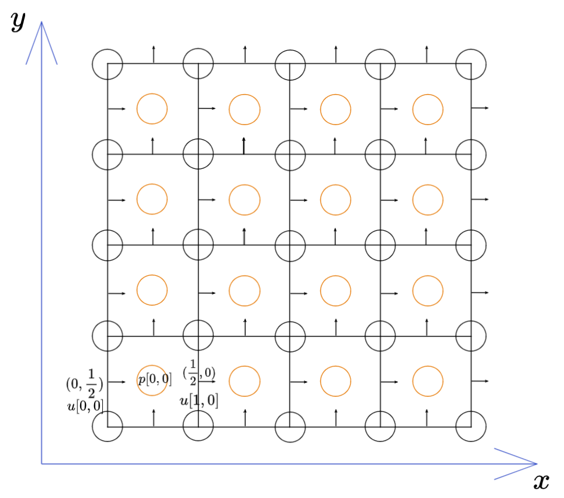

# Physically based Fluid Simulation

This is a course project of 252-0546-00L Physically-Based Simulation in Computer Graphics HS2022 at ETH Zurich. We wish to provide an easy-to-understand pipeline for fluid simulation incorporating different basic algorithms. We assume that you have some basic theoretical understanding about fluid simulation

## Usage

### Requirements

- Python 3.10.4
- Taichi 1.2.2
- click

### Installation

``` bash
pip install taichi==1.2.2
pip install click
```

### Run

``` bash
# show instructions
python plume_sim.py --help

# example usage
## default arguments with solid boundary
python plume_sim.py -b

## change some arguments
python plume_sim.py --advection=SL --interpolation=bilerp --solver=CG -b
# in short
python plume_sim.py -a SL -e bilerp -s CG -b
```

## Results

<!-- TODO -->

## Theory
To solve a fluid simulation problem, we divide the problem into three steps.

$$
\begin{align}
\frac{Dq}{Dt}  & = 0   & \quad \text{(advection)}\\
\frac{ \partial \mathbf{u} }{ \partial t } &  = \mathbf{f} & \quad \text{(body forces)}  \\
\frac{ \partial \mathbf{u} }{ \partial t } + \frac{1}{\rho}\nabla p &  = 0 \quad \text{s.t. } \nabla \cdot \mathbf{u} = 0 & \quad \text{(pressure/incompressibility)}
\end{align}
$$

A simple fluid simulation algorithm contains the following steps
> - Start with an initial divergence-free velocity filed $\mathbf{u}^{(0)}$
> - For time step $n=0,1,2,\dots$
> 	- Determine a good time step $\Delta t$ to go from time $t_{n}$ to time $t_{n+1}$
> 	- Set $\mathbf{u}^{A} = \textsf{advect}(\mathbf{u}^{n}, \Delta t, \mathbf{u}^{n})$
> 	- Add $\mathbf{u}^{B} = \mathbf{u}^{A} + \Delta t \mathbf{f}$
> 	- Set $\mathbf{u}^{n+1} = \textsf{project}(\Delta t, \mathbf{u}^{B})$

## Data Structure
The entire simulation occurs in a MAC grid

The origin is set to be the left-bottom corner of the grid. Since in code, the values of quantities are saved on integer positions, for example, `p[0,0]` corresponds $p(0.5, 0.5)$ on grid. Thus we define the offset to be the $(x, y)$ difference between the left-bottom position and the origin. In resume, 
- $\text{offset}(\text{pressure}) = (0.5, 0.5)$
- $\text{offset}(\text{velocity}_{x}) = (0.0, 0.5)$
- $\text{offset}(\text{velocity}_{y}) = (0.5, 0.0)$

Besides, we define a method to get a quantity value at arbitrary position on the grid using bilerp or cerp. 


### Bilerp
The Wikipedia for bilinear interpolation is already clear enough. Please refer to 
[Bilinear interpolation - Wikipedia](https://en.wikipedia.org/wiki/Bilinear_interpolation)

### Cerp
Please refer to
[Cubic Hermite spline - Wikipedia](https://en.wikipedia.org/wiki/Cubic_Hermite_spline#Interpolation_on_the_unit_interval_without_exact_derivatives)
[Bicubic interpolation - Wikipedia](https://en.wikipedia.org/wiki/Bicubic_interpolation)
[Bicubic Interpolation (mcmaster.ca)](https://www.ece.mcmaster.ca/~xwu/interp_1.pdf)

You may ask how to deal with position where bilerp or cerp are not defined on the boundary. We simply clamp the position back to the boundary.

## Advection
<!-- TODO -->

### Semi-Lagrangian
This is a simple, physically-motivated approach. The idea is very simple: 
The new value of $q$ at some point $\mathbf{x}$ in space is just what the old value of $q$ was for the particle that ends up at $\mathbf{x}$. 

Imagine we have a hypothetical particle. At time $t$, it has an old value $q_{P}^{n}$ at point $\mathbf{x}_{P}$, and at time $t+\Delta t$, it has a new value $q^{n+1}_{G}$ at point $\mathbf{x}_{G}$. Then $q_{G}^{n+1} = q_{P}^{n}$. 

If we have the current state, we could say that after $\Delta t$, the particle at $\mathbf{x}_{P}$ will arrive at point $\mathbf{x}_{G}$
$$
\mathbf{x}_{P} = \mathbf{x}_{G} - \Delta t \mathbf{u}_{G}
$$
then we could update the state and say that the particle at $\mathbf{x}_{G}$ at $t+\Delta t$ has value $q_{P}^{n}$. If the point $\mathbf{x}_{P}$ is not on the grid, we could interpolate it from $q^{n}$ at nearby grid points. 

Putting all together, the simplest semi-Lagrangian formula is 
$$
q_{g}^{n+1} = \textsf{intpolate}(q^{n}, \mathbf{x}_{G}-\Delta t\mathbf{u}_{G})
$$

Different integration schemes could be used in this step, i.e. the step
$$
\mathbf{x}_{P} = \mathbf{x}_{G} - \Delta t \mathbf{u}_{G}
$$
We could use
- Euler
- 3rd Order Runge-Kutta 
It greatly improves integration accuracy without being overly complex.

### MacCormack
The MacCormack algorithm is simple but greatly reduce the error induced by Semi-Lagrangian


### FLIP/PIC
<!-- TODO -->

## Apply Body Forces
This step is fairly easy. Just update the velocity using Euler method

Remember to set the boundary condition for velocity after this step

## Projection
<!-- TODO -->


## Advection-Reflection
<!-- TODO -->

## Known Bugs
<!-- TODO -->

## Reference

- [Fluid Simulation for Computer Graphics, Second Edition](http://wiki.cgt3d.cn/mediawiki/images/4/43/Fluid_Simulation_for_Computer_Graphics_Second_Edition.pdf)
- [An Advection-Reflection Solver for Detail-Preserving Fluid Simulation](https://jzehnder.me/publications/advectionReflection/)
- [A Second-Order Advection-Reflection Solver](https://www.cse.iitd.ac.in/~narain/ar2/)
- [@tunabrain/incremental-fluids](https://github.com/tunabrain/incremental-fluids)
- [@Robslhc/WaterSim](https://github.com/Robslhc/WaterSim)
- [@taichi-dev/taichi](https://github.com/tunabrain/taichi-dev/taichi)
- [tunabrain/incremental-fluids: Simple, single-file fluid solvers for learning purposes (github.com)](https://github.com/tunabrain/incremental-fluids)
- [FLUID SIMULATION SIGGRAPH 2007 Course Notes](https://www.cs.ubc.ca/~rbridson/fluidsimulation/fluids_notes.pdf)
